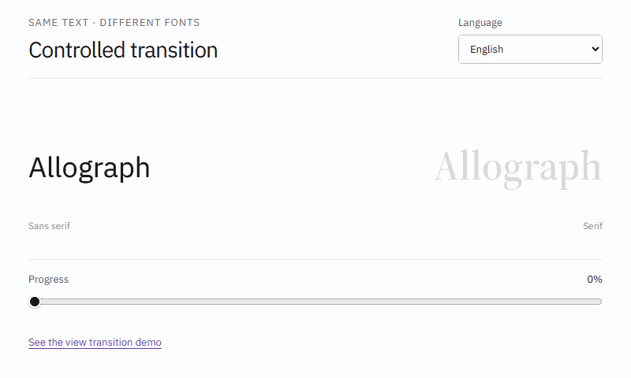

# Glyphflux

Glyphflux morphs between *allographs* (i.e., the same text across different fonts), without the folding and twisting of characters produced by naive SVG point matching.



The correspondence is solved deterministically at build time, using signed distance fields (SDF) on an HTML canvas. The browser only
interpolates compact prepared geometry at `t ∈ [0, 1]`, with exact DOM-text
handoffs at both endpoints.

**Demo Site:** [glyphflux.com](https://glyphflux.com)

## Installation

```sh
npm install glyphflux
```

## Summary

- Latin Serif ↔ Sans and script-specific equivalents such as Japanese Mincho ↔ Japanese Gothic
- Complex shaping, including ligatures, bidirectional text, combining marks, and connectivity changes
- Deterministic, network-free builds with no machine learning or per-character overrides
- Framework-agnostic runtime; React + TanStack Start power only the demo

## Building the font morph

Glyphflux does its calculations locally on the server, before deployment. Your build
must provide the exact text and font instances that can morph, then publish the
result as a static JSON asset. The normal browser path only reconstructs this
prepared data; it does not run the SDF compiler.

Create `glyphflux.config.json` with the text and font instances your application
will morph:

```json
{
  "texts": ["Allograph"],
  "fonts": {
    "sans": ["public/fonts/example-sans.ttf"],
    "serif": ["public/fonts/example-serif.ttf"]
  },
  "morphs": [{
    "source": { "role": "sans", "weights": [400], "opticalSizes": [0] },
    "target": { "role": "serif", "weights": [600], "opticalSizes": [20, 23] }
  }],
  "output": {
    "manifests": "public/glyphflux.json"
  }
}
```

`texts` is the simplest input. Larger applications can additionally configure
`documents` to discover same-text endpoints across MDX globs and `catalogs` to
resolve those strings for any number of locales. Font arrays are fallback
stacks, each `morphs` entry expands its configured responsive instances, and
`output` controls the static manifest plus an optional text-to-locale module.

The `$schema` property is not required: the CLI always validates the config. If
your editor supports JSON Schema, you may point it at
`https://glyphflux.com/config-schema.json` for autocomplete and inline errors.

Run the workspace version during development:

```sh
pnpm --filter glyphflux build
pnpm glyphflux build
```

The second command invokes the local workspace binary and never accesses npm.
After publication, `npx glyphflux build` runs the same CLI. In CI, pin Glyphflux
and use `glyphflux build` from `prebuild` rather than downloading an unpinned
version with `npx`.

The CLI rejects unmatched endpoints, missing translations, unsupported glyphs,
and invalid font instances. Identical inputs produce byte-stable manifests;
unknown runtime text can use the optional worker fallback.

Configure Glyphflux during client startup and return the generated manifest
from `loadPreparedOutlines`. One compiled direction supports both directions:

```ts
import { configureFontMorph, type FontMorphPreparedManifest } from 'glyphflux'
import 'glyphflux/styles.css'

let prepared: Promise<FontMorphPreparedManifest> | undefined

configureFontMorph({
  fontFiles: {
    sans: ['/fonts/example-sans.ttf'],
    serif: ['/fonts/example-serif.ttf'],
  },
  loadPreparedOutlines: () =>
    (prepared ??= fetch('/glyphflux/en.json').then((response) => {
      if (!response.ok) throw new Error(`Glyphflux data: ${response.status}`)
      return response.json()
    })),
})
```

## Using the font morph

### Control the morph

Mount the same text at both endpoints, then map any value from `0` to `1` onto
the morph:

```html
<span id="source" class="sans">Allograph</span>
<span id="target" class="serif">Allograph</span>
<input id="progress" type="range" min="0" max="1" step="0.01" />
```

```ts
import { createFontMorphProgressController } from 'glyphflux'

const morph = await createFontMorphProgressController({
  source: document.querySelector<HTMLElement>('#source')!,
  target: document.querySelector<HTMLElement>('#target')!,
})

const slider = document.querySelector<HTMLInputElement>('#progress')!
slider.addEventListener('input', () => morph.setProgress(slider.valueAsNumber))
```

The controller uses the same prepared renderer and endpoint measurements as
route transitions and deterministic replay; only ownership of `t` changes.

### Set up a view transition

Give the source and destination the same key and unchanged text. Preload the
build-generated correspondence, start the morph, then let your client-side
router replace the route:

```tsx
import { beginFontMorph, prepareFontMorph } from 'glyphflux'

// Source route
<h1 className="sans" data-font-morph="title">Allograph</h1>

await prepareFontMorph('title') // preload during initial render or route prefetch

function openDetails(navigate: (path: string) => void) {
  beginFontMorph('title')
  navigate('/details')
}

// Destination route
<h1 className="serif" data-font-morph="title">Allograph</h1>
```

The route can also change surrounding content, position, size, and color.
Glyphflux reconstructs the precomputed correspondence in the browser, so the
transition adds little runtime overhead.

## Local demo

From this repository, install dependencies, build the package, and run the
multilingual controlled and route-transition demos:

```sh
corepack pnpm install
corepack pnpm --filter glyphflux build
corepack pnpm --filter glyphflux demo
```

The demo generator runs automatically before the dev server. For a production
demo build or the package checks:

```sh
corepack pnpm --filter glyphflux demo:sdf
corepack pnpm --filter glyphflux demo:build
corepack pnpm --filter glyphflux test
corepack pnpm --filter glyphflux typecheck
```

The build-time compiler is exported from `glyphflux/compiler`; the low-level
SDF runtime is exported from `glyphflux/sdf`.